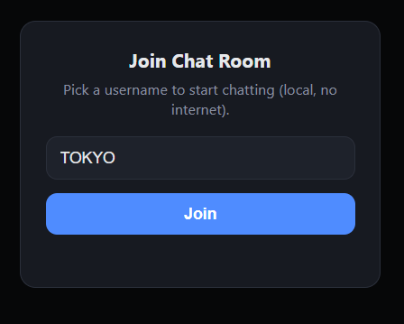
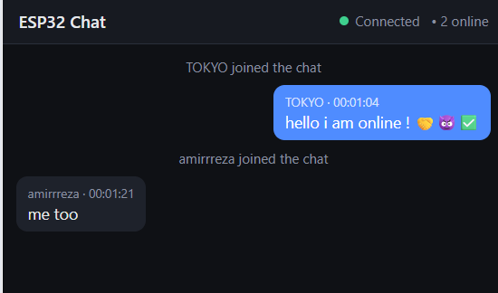

# ESP32 Local Wi-Fi Group Chat 💬

A lightweight, fully offline group chat that runs entirely on an ESP32.
The ESP32 acts as its own Wi-Fi Access Point — no internet, no router, no
database, no external CDN/fonts/JS. Connect to its Wi-Fi, open
`192.168.4.1`, pick a username, and start chatting in real time over
WebSocket.

---

## ✨ Features

- 📡 ESP32 runs as a standalone Wi-Fi Access Point (no internet required)
- 🌐 Chat web app served directly at `http://192.168.4.1`
- ⚡ Real-time messaging via WebSocket
- 👥 Multi-user group chat room
- 🧠 In-RAM message history only (last ~60 messages) — wiped on restart
- 🙍 Username selection on join
- 🕒 Username + message + simple uptime timestamp
- 🔢 Live online user count
- 🔔 Join / leave notifications
- 🛡️ Username & message length limits + basic per-client rate limiting
- 🧼 Input sanitization + safe rendering (XSS-safe, no `innerHTML`)
- 🌙 Mobile-friendly modern dark UI
- 📜 Auto-scroll + live connection status indicator
- 📦 Zero external dependencies at runtime — everything is embedded in flash

---

## 📷 Environment






---

## 🧩 Architecture

| Component        | Choice                                             |
|-------------------|----------------------------------------------------|
| Access Point       | Built-in `WiFi.h` (`WiFi.softAP`)                  |
| Web + WebSocket    | `ESPAsyncWebServer` + `AsyncTCP`                    |
| Message protocol   | Tiny custom text protocol (no JSON overhead)        |
| Storage            | Fixed-size circular buffer in RAM (no DB, no flash) |
| Frontend           | Single embedded HTML/CSS/JS page (`PROGMEM`)        |

No dynamic allocation-heavy libraries, no persistent storage, no SD card —
designed to keep RAM/CPU overhead low and be safe to run continuously.

---

## 📁 Project Structure

```
esp32_chat/
├── esp32_chat.ino   # Main sketch: AP + WebServer + WebSocket logic
└── page.h            # Embedded HTML/CSS/JS chat UI (PROGMEM)
```

> Both files must be in the **same folder**, with the folder name matching
> the `.ino` file name (Arduino IDE requirement).

---

## 🛠️ Requirements

- Arduino IDE 2.x (recommended) or 1.8.x
- ESP32 board support package
- Any ESP32 dev board (ESP32-WROOM32, ESP32-S3, ESP32-C3, etc.)

---

## 📦 Required Libraries

Install these before compiling:

| Library | Link | Notes |
|---|---|---|
| **AsyncTCP** | https://github.com/mathieucarbou/AsyncTCP | Maintained fork, works with modern ESP32 cores |
| **ESPAsyncWebServer** | https://github.com/mathieucarbou/ESPAsyncWebServer | Maintained fork, pairs with the AsyncTCP fork above |

> ⚠️ Avoid the older `me-no-dev/AsyncTCP` and `me-no-dev/ESPAsyncWebServer`
> repos — they're unmaintained and can fail to compile on newer ESP32 core
> versions. Use the `mathieucarbou` forks linked above.

---

## 🚀 Setup Instructions

### 1. Install the ESP32 board package
- Arduino IDE → **File → Preferences**
- Add this URL to *Additional Boards Manager URLs*:
  ```
  https://raw.githubusercontent.com/espressif/arduino-esp32/gh-pages/package_esp32_index.json
  ```
- **Tools → Board → Boards Manager** → search `esp32` → install (Espressif Systems)

### 2. Install the required libraries
- Download **AsyncTCP** as ZIP: https://github.com/mathieucarbou/AsyncTCP → Code → Download ZIP
- Download **ESPAsyncWebServer** as ZIP: https://github.com/mathieucarbou/ESPAsyncWebServer → Code → Download ZIP
- In Arduino IDE: **Sketch → Include Library → Add .ZIP Library** → select each ZIP
- **Restart Arduino IDE completely** after installing

### 3. Get the project files
- Clone or download this repository
- Open `esp32_chat/esp32_chat.ino` in Arduino IDE
  (make sure `page.h` is present in the same folder/tab list)

### 4. Configure Wi-Fi credentials (optional)
Edit these lines at the top of `esp32_chat.ino` if you want a different
network name/password:
```cpp
const char* AP_SSID     = "ESP32-ChatRoom";
const char* AP_PASSWORD = "chat12345";   // min 8 characters, or "" for open network
```

### 5. Select your board & port
- **Tools → Board** → choose your ESP32 board (e.g. "ESP32 Dev Module")
- **Tools → Port** → select the correct COM/serial port

### 6. Upload
Click **Upload**. Once flashing completes, open the Serial Monitor
(115200 baud) to confirm the AP started and see the IP address.

### 7. Connect & chat
1. On your phone or laptop, join the Wi-Fi network **`ESP32-ChatRoom`**
2. Open a browser and go to `http://192.168.4.1`
3. Enter a username and start chatting
4. Repeat on other devices — everyone joins the same room

---

## ⚙️ Configuration Reference

| Setting | Location | Default |
|---|---|---|
| SSID / Password | `esp32_chat.ino` top constants | `ESP32-ChatRoom` / `chat12345` |
| Max connected clients | `AP_MAX_CONN` | 8 |
| Message history kept in RAM | `MAX_HISTORY` | 60 |
| Max username length | `MAX_USERNAME_LEN` | 20 |
| Max message length | `MAX_MESSAGE_LEN` | 200 |
| Min time between messages per user | `MIN_MSG_INTERVAL_MS` | 400 ms |

---

## 🔒 Notes on Safety & Limitations

- Chat history is **RAM-only** — it's gone the moment the ESP32 restarts, by design.
- Messages are sanitized server-side and rendered via `textContent` on the
  client, so injected HTML/JS in a message can't execute.
- Basic per-client rate limiting protects against flooding, but this is
  **not** a hardened multi-user production service — intended for local,
  trusted, small-group use (e.g. classrooms, campsites, LAN parties, field work).
- No authentication beyond the Wi-Fi password — anyone on the AP can join
  and pick any username.

---

## 🐛 Troubleshooting

**`AsyncTCP.h: No such file or directory`**
Library wasn't installed or indexed. Reinstall via ZIP (see step 2 above)
and fully restart the Arduino IDE.

**Compile errors after installing libraries**
Make sure you installed the `mathieucarbou` forks of both libraries (not
the older `me-no-dev` versions), and that your ESP32 board package is
reasonably up to date (Boards Manager → esp32 → Update).

**Can't reach `192.168.4.1`**
Make sure your device is actually connected to the `ESP32-ChatRoom`
Wi-Fi network (not still on your home/mobile network), and that mobile
data / Wi-Fi assist isn't overriding the connection.

**Page loads but chat doesn't connect**
Check Serial Monitor for AP status, and make sure your browser isn't
blocking `ws://` connections (some browsers restrict mixed content on
HTTPS pages — this project should be accessed via plain `http://`).

---

## 📜 License

Use, modify, and distribute freely for personal or educational projects.
